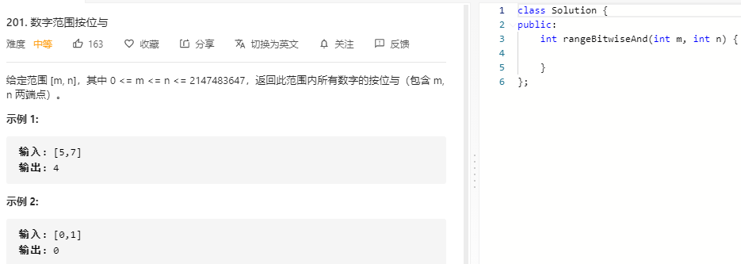

### 题目要求



### 解题思路

寻找两个数的二进制的公共前缀。因为数字是连续的。

### 本题代码

```c++
class Solution {
public:
    int rangeBitwiseAnd(int m, int n) {
        if(m < 0 || n > INT_MAX)
            return 0;
        while(m < n){
            n -= n & (~n+1);
        }
        return n;
    }
};
```

### [手撸测试](https://leetcode-cn.com/problems/bitwise-and-of-numbers-range/)  

