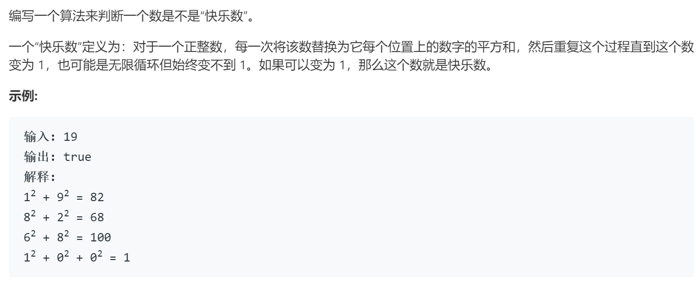

### 题目要求



### 解题思路

快慢指针解题。思路就是使用快慢指针的思想去判断是否是循环，如果是循环，那么判断循环点是不是在等于1处。

### 本题代码

```c++
class Solution {
public:
    bool isHappy(int n) {
        int slow = n, fast = n;
        do{
            slow = helper(slow);
            fast = helper(fast);
            fast = helper(fast);
        }
        while(slow != fast);
        return slow == 1;
    }
    int helper(int n){
        int sum = 0;
        while(n != 0){
            int bit = n % 10;
            sum += bit * bit;
            n = n / 10;
        }
        return sum;
    }
};
```

### [手撸测试](https://leetcode-cn.com/problems/happy-number/)  
