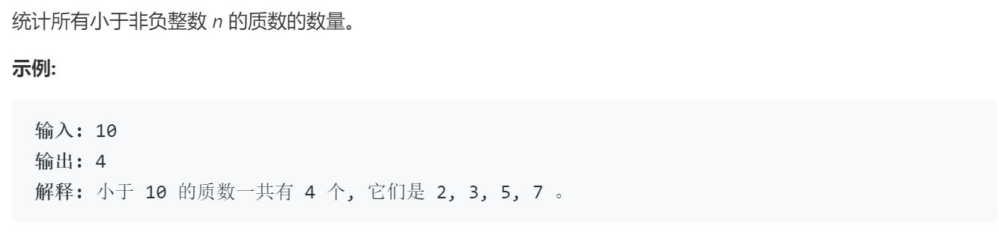

### 题目要求



### 解题思路

质数的定义是只能被自己和1整除的数。如果一个数`i`是质数，那么它的`2i`、`3i`等都不是质数。另外不需判断到`n`处只需用判断到$$sqrt(n)$$即可，因为是对称的。

### 本题代码

```c++
class Solution {
public:
    int countPrimes(int n) {
       if(n < 2){
           return 0;
       } 
       vector<bool>res;
       res.resize(n, true);
       for(int i = 2;i * i < n;i++){
           if(res[i]){
               for(int j = i*i;j < n;j += i){
                   res[j] = false;
               }
           }
       }
       int count = 0;
       for(int i = 2;i < n;i++){
           if(res[i]){
               count++;
           }
       }
       return count;
    }
};
```

### [手撸测试](https://leetcode-cn.com/problems/count-primes/submissions/)  

