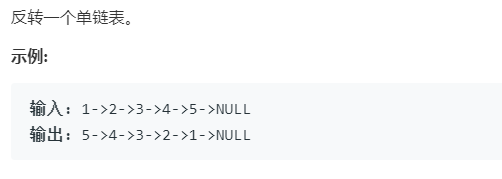

### 题目要求



### 解题思路

简单题，直接原地反转列表。

### 本题代码

```c++
class Solution {
public:
    ListNode* reverseList(ListNode* head) {
        if(head == NULL)
            return head;
        ListNode* pre = NULL;
        ListNode* next = NULL;
        while(head != NULL){
            next = head->next;
            head->next = pre;
            pre = head;
            head = next;
        }
        return pre;
    }
};
```


### [手撸测试](https://leetcode-cn.com/problems/reverse-linked-list/) 
