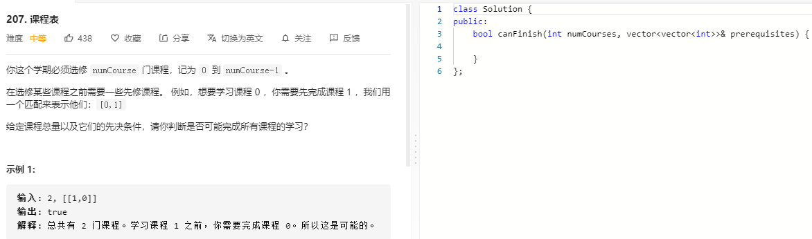
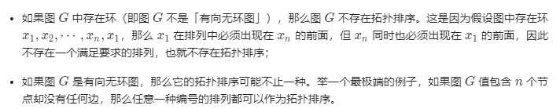

### 题目要求



### 解题思路

本题是拓扑排序类型题目。

给定一个包含 $$n$$ 个节点的有向图 $$G$$，我们给出它的节点编号的一种排列，如果满足：

> 对于图 $$G$$ 中的任意一条有向边 $$(u, v)$$，$$u$$ 在排列中都出现在 $$v$$ 的前面。

那么称该排列是图 $$G$$ 的「拓扑排序。根据定义有两个性质：



判断 G 是否具有拓扑排序，就可以通过遍历的方法。具体先构建图节点的入度(多少节点是到达本节点)以及各个节点相邻的边，然后将入度为0的节点压入queue遍历(广度优先)，最终所有入度为0的节点=节点个数，那么改 G 具有拓扑排序。 

### 本题代码

```c++
class Solution {
public:
    bool canFinish(int numCourses, vector<vector<int>>& prerequisites) {
        vector<int>degree(numCourses, 0);
        vector<vector<int>>graph(numCourses, vector<int>());
        for(auto req: prerequisites){
            graph[req[1]].push_back(req[0]);
            degree[req[0]]++;
        }
        queue<int>q;
        for(int i = 0;i < degree.size();i++){
            if(degree[i] == 0)
                q.push(i);
        }
        int res = 0;
        while(!q.empty()){
            ++res;
            int node = q.front();
            q.pop();
            for(auto x: graph[node]){
                degree[x]--;
                if(degree[x] == 0)
                    q.push(x);
            }
        }
        return res == numCourses;
    }
};
```

### [手撸测试](https://leetcode-cn.com/problems/course-schedule/)  

