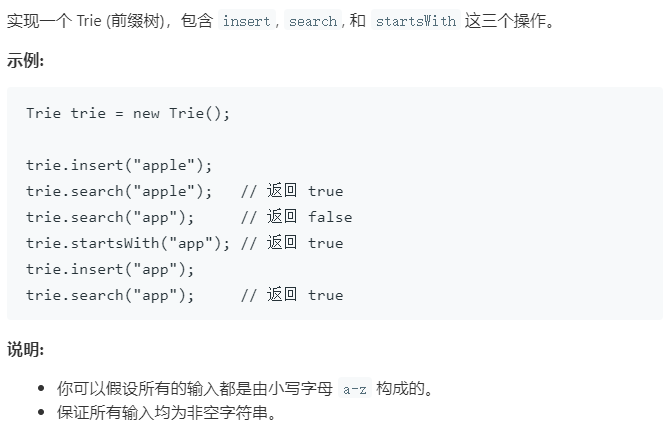
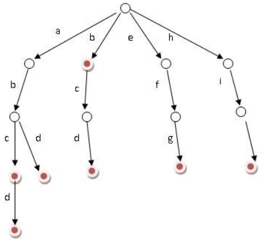

### 题目要求



### 解题思路

字典树(也叫前缀树，读音是try)的思路很简单，主要是`cpp`的程序语言细节有时会出错--主要是初始话。构建一个字典树明显不是一个二叉树是一个多叉数，后继节点保存在`Node`类型的指针数组`m`里，大小为26(26个字母是一家~~)。字典树中节点都需要有两个属性`path`和`end`，`path`表明经过该节点的单词的个数，`end`表示以该节点结尾的单词的个数。该题记住一个图:



### 本题代码

```c++
class trieNode{
    public:
    int path;
    int end;
    trieNode* m[26];
    trieNode(){
        path = 0;
        end = 0;
        memset(m,0,sizeof(m));//这里的初始化需要做，否则会越界
    }
};
class Trie {
public:
    /** Initialize your data structure here. */
    trieNode* root;
    Trie() {
        root = new trieNode();//千万不要重复定义，否则也会越界
    }
    
    /** Inserts a word into the trie. */
    void insert(string word) {
        if(word.size() == 0)
            return;
        trieNode* node = root;
        for(int i = 0;i < word.size();i++){
            int index = word[i] - 'a';
            if(node->m[index] == NULL)
                node->m[index] = new trieNode();
            node = node->m[index];
            node->path++;
        }
        node->end++;
    }
    
    /** Returns if the word is in the trie. */
    bool search(string word) {
        if(word.size() == 0)
            return false;
        trieNode* node = root;
        for(int i = 0;i < word.size();i++){
            int index = word[i] - 'a';
            if(node->m[index] == NULL)
                return false;
            node = node->m[index];
        }
        return node->end != 0;//搜索要搜索完整，必须改节点为结尾，否则是前缀。
    }
    
    /** Returns if there is any word in the trie that starts with the given prefix. */
    bool startsWith(string prefix) {
        if(prefix.size() == 0)
            return false;
        trieNode* node = root;
        for(int i = 0;i < prefix.size();i++){
            int index = prefix[i] - 'a';
            if(node->m[index] == NULL)
                return false;
            node = node->m[index];
        }
        return node->path;
    }
};
```

### [手撸测试](<https://leetcode-cn.com/problems/implement-trie-prefix-tree/>) 

