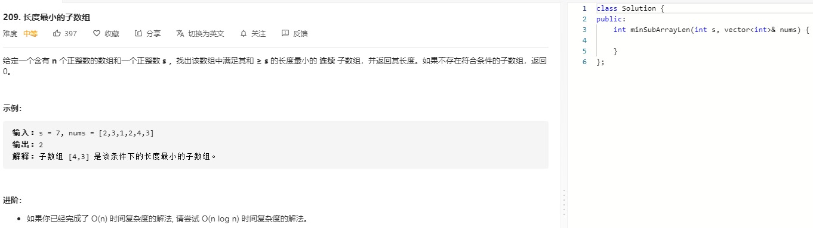

### 题目要求



### 解题思路

算法思路很多，最典型的就是双指针加上滑动窗口一把梭。

### 本题代码

```c++
class Solution {
public:
    int minSubArrayLen(int s, vector<int>& nums) {
        if(nums.size() == 0)
            return 0;
        int res = INT_MAX;
        int left = 0, right = 0;
        int sum = 0;
        while(right < nums.size()){
            sum += nums[right];
            if(sum >= s){
                while(sum >= s){
                    res = min(res, right-left+1);
                    sum -= nums[left];
                    left++;
                }
            }
            right++;
        }
        return res == INT_MAX ? 0 : res;
    }
};
```

### [手撸测试](https://leetcode-cn.com/problems/minimum-size-subarray-sum/)   

