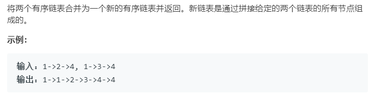

### 题目要求



### 解题思路

直接手撸，太基础了。

### 本题代码

```c++
class Solution {
public:
    ListNode* mergeTwoLists(ListNode* l1, ListNode* l2) {
        if(l1 == NULL || l2 ==NULL)
            return l1 ? l1 : l2;
        ListNode* Head = new ListNode(0);
        ListNode* tail = Head;
        while(l1 != NULL && l2 != NULL){
            if(l1->val < l2->val){
                tail->next = l1;
                tail = l1;
                l1 = l1->next;
            }
            else{
                tail->next = l2;
                tail = l2;
                l2 = l2->next;
            }
        }
        tail->next = l1 != NULL ? l1 : l2;
        return Head->next;
    }
};
```

### [手撸测试](<https://leetcode-cn.com/problems/merge-two-sorted-lists/>) 

