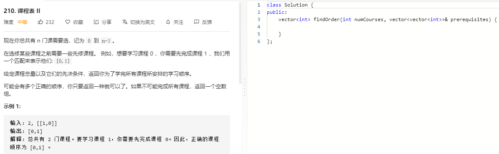

### 题目要求



### 解题思路

参考 [拓扑排序](https://nlper.gitbook.io/leetcode/207)。 

### 本题代码

```c++
struct graphNode{
    int val;
    vector<graphNode*> neighbor;
    graphNode(int x): val(x){}
};
class Solution {
public:
    vector<int> findOrder(int numCourses, vector<vector<int>>& prerequisites) {
        vector<int>degree(numCourses);
        vector<graphNode*>graph;
        for(int i = 0;i < numCourses;i++)
            graph.push_back(new graphNode(i));
        for(auto req: prerequisites){
            graph[req[1]]->neighbor.push_back(graph[req[0]]);
            degree[req[0]]++;
        }
        int node_num = 0;
        queue<graphNode*>q;
        for(int i = 0;i < numCourses;i++)
            if(degree[i] == 0)
                q.push(graph[i]);
        vector<int>res;
        while(!q.empty()){
            ++node_num;
            graphNode* node = q.front();
            res.push_back(node->val);
            for(auto nei: node->neighbor){
                degree[nei->val]--;
                if(degree[nei->val] == 0)
                    q.push(nei);
            }
            q.pop();
        }
        return node_num == numCourses ? res : vector<int>();
    }
};
```

### [手撸测试](https://leetcode-cn.com/problems/course-schedule-ii/)  

