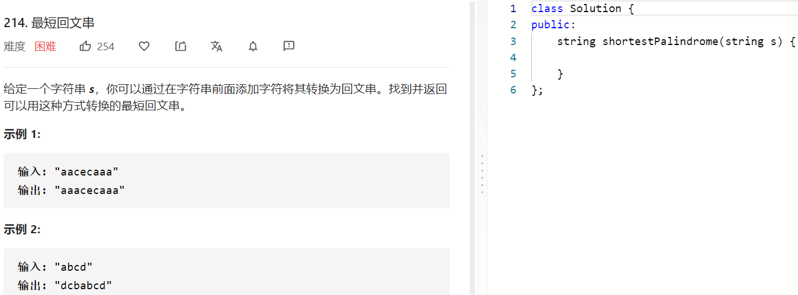

### 题目要求



### 解题思路

总体的思路是从s中找到前缀prex使得pre是回文字串，那么后缀last反转补充到s的前面就可以得到一个回文串，要求后缀最小就是要求前缀prex最长。双指针解法，起始i在0位置，j在size-1的位置，相等i++,j++，不相等j--直到j<0，此时i的位置要么是last的第一个字符要么是last中的某一个，那么前缀的分界点一定在prex中，递归解就可以。

### 本题代码

```c++
class Solution {
public:
    string shortestPalindrome(string s) {
        int i = 0;
        int j = s.size()-1;
        while(j >= 0){
            if(s[i] == s[j])
                i++;
            j--;
        }
        if(i == s.length()){
            return s;
        }
        string str = s.substr(i);
        string rev = str;
        reverse(rev.begin(), rev.end());
        return rev + shortestPalindrome(s.substr(0, i)) + str;
    }
};
```

### [手撸测试](https://leetcode-cn.com/problems/shortest-palindrome/)   

