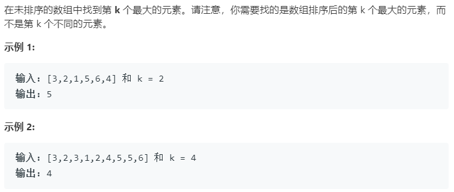

### 题目要求



### 解题思路

维护一个大小为k的小根堆。`cpp`中小根堆是[优先级队列](https://blog.csdn.net/cainv89/article/details/51588920)，尽量熟悉其[用法](https://blog.csdn.net/weixin_36888577/article/details/79937886)。基本逻辑是：维护一个大小为k的小根堆，不足k个就直接压入，当遇到大于堆顶的就先pop堆顶然后压入。

### 本题代码

```c++
class Solution {
public:
    int findKthLargest(vector<int>& nums, int k) {
        if(nums.size() < k)
            return -1;
        priority_queue<int, vector<int>, greater<int>>q;
        for(int i = 0;i < nums.size();i++){
            if(q.size() != k){
                q.push(nums[i]);
            }
            else if(q.top() < nums[i]){
                q.pop();
                q.push(nums[i]);
            }
        }
        return q.top();
    }
};
```

### [手撸测试](https://leetcode-cn.com/problems/kth-largest-element-in-an-array/) 
