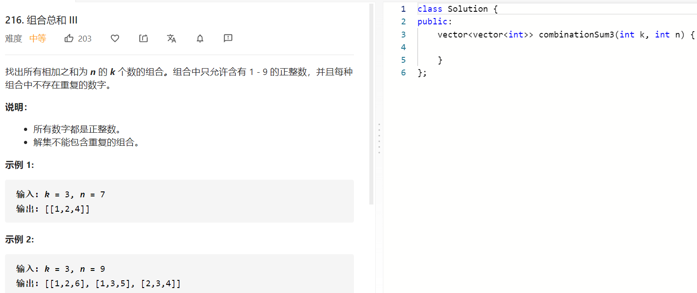

### 题目要求



### 解题思路

选或者不选，并且只能从某个范围中选择，套路都是一样的。连提前终止的条件都很相像。

### 本题代码

```c++
class Solution {
public:
    vector<vector<int>>res;
    vector<vector<int>> combinationSum3(int k, int n) {
        vector<int>path;
        dfs(path, k, n, 0, 1);
        return res;
    }
    void dfs(vector<int>& path, int k, int n, int sum, int cur){
        if(path.size() + 10 - cur < k || sum > n || path.size() > k)
            return;
        sum += cur;
        path.push_back(cur);
        if(path.size() == k && sum == n){
            res.push_back(path);
            //return;
        }
        dfs(path, k, n, sum, cur+1);
        sum -= cur;
        path.pop_back();

        dfs(path, k, n, sum, cur+1);
    }
};
```

### [手撸测试](https://leetcode-cn.com/problems/combination-sum-iii/)  

