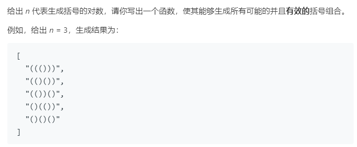

### 题目要求



### 解题思路

思路可以使用动态规划来解决--当知道所有 `i<n` 的情况时，我们可以通过某种算法算出 `i=n` 的情况。`n`对括号有效那么`n-1`有效的括号要么在括号内部要么在括号外部，也就是说：遍历："(" + 【i=p时所有括号的排列组合】 + ")" + 【i=q时所有括号的排列组合，其中`p + q = n-1`。代码写法有些像斐波那契数列。

### 本题代码

```c++
class Solution {
public:
    vector<string> generateParenthesis(int n) {
        if(n == 0)
            return {""};
        if(n == 1)
            return {"()"};
        vector<vector<string>>dp(n + 1);
        dp[0] = {""};
        dp[1] = {"()"};
        for(int i = 2;i <= n;i++){
            for(int j = 0;j < i;j++){
                for(string q : dp[j]){
                    for(string p : dp[i - j - 1]){
                        string s = '(' + q + ')' + p;
                        dp[i].push_back(s);
                    }
                }
            }
        }
        return dp[n];
    }
};
```

### [手撸测试](<https://leetcode-cn.com/problems/generate-parentheses/>) 

