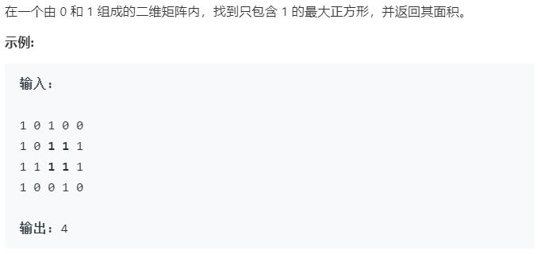

### 题目要求



### 解题思路

动态规划大法好！核心点：构建动态规划表$$dp$$，当`matrix[i][j] == '1'`时，以其为正方形的右下角最大边长的动态方程：$$dp[i][j] = min(min(dp[i - 1][j], dp[i][j - 1]), dp[i - 1][j - 1])$$。那么代码就显而易见。

### 本题代码

```c++
class Solution {
public:
    int maximalSquare(vector<vector<char>>& matrix) {
        if(matrix.size() == 0)
            return 0;
        int rows = matrix.size();
        int cols = matrix[0].size();
        vector<vector<int>> dp(rows + 1, vector<int>(cols + 1, 0));
        int maxS = 0;
        for(int i = 1;i <= rows;i++){
            for(int j = 1;j <= cols;j++){
                if(matrix[i - 1][j - 1] == '1'){
                    dp[i][j] = min(min(dp[i - 1][j], dp[i][j - 1]), dp[i - 1][j - 1]) + 1;
                    maxS = max(dp[i][j], maxS);
                }
            }
        }
        return maxS * maxS;
    }
};
```

### [手撸测试](https://leetcode-cn.com/problems/maximal-square/) 

