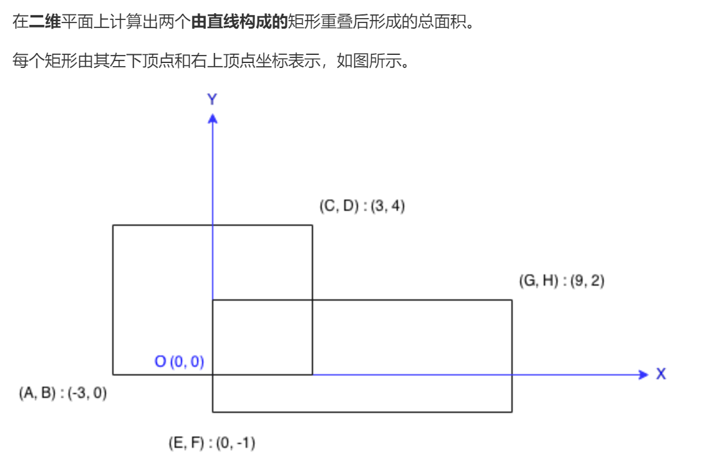

### 题目要求



### 解题思路

题目的要求是求出所有线围成的总面积。

多画几个图可以得到**如下规律**：
1）重合矩阵的左边是两个矩阵左边(A、E)的更大的那条边(即为max(A, E))。
右边是两个矩阵右边(C、G)的更小的那条边。
2）左边的坐标若大于右边，则没有重合。

### 本题代码

```c++
class Solution {
public:
    int computeArea(int A, int B, int C, int D, int E, int F, int G, int H) {
        int s1 = (C - A) * (D - B);
        int s2 = (G - E) * (H - F);
        int left = max(A, E);
        int right = min(C, G);
        int up = min(D, H);
        int down = max(B, F);
        if (left >= right || up <= down){
            return s1 + s2;
        }
        int cover = (right - left) * (up - down);
        return s1 + (s2 - cover);
    }
};
```

### [手撸测试](https://leetcode-cn.com/problems/rectangle-area/)  

