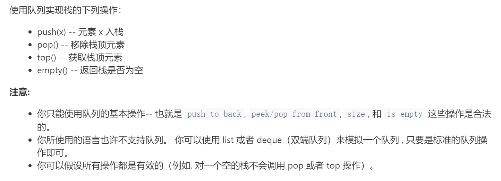

### 题目要求



### 解题思路

栈的特性先进后出，后进先出。两个队列中其中一个展现出栈的特性，两次导数据。

### 本题代码

```c++
class MyStack {
public:
    /** Initialize your data structure here. */
    MyStack() {
        
    }
    
    /** Push element x onto stack. */
    void push(int x) {
        queue<int>temp_queue;
        temp_queue.push(x);
        
        while(!_data.empty()){
            temp_queue.push(_data.front());
            _data.pop();
        }
        
        while(!temp_queue.empty()){
            _data.push(temp_queue.front());
            temp_queue.pop();
        }
        
    }
    
    /** Removes the element on top of the stack and returns that element. */
    int pop() {
        int x = _data.front();
        _data.pop();
        return x;
    }
    
    /** Get the top element. */
    int top() {
        return _data.front();
    }
    
    /** Returns whether the stack is empty. */
    bool empty() {
        return _data.empty();
    }
    private:
    queue<int>_data;
    
};
```

### [手撸测试](https://leetcode-cn.com/problems/implement-stack-using-queues/)  

