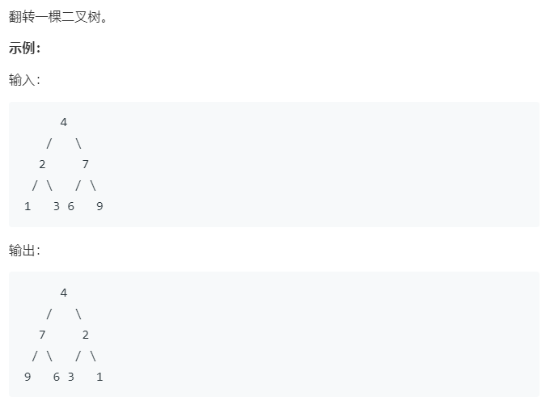

### 题目要求



### 解题思路

直接先序遍历递归求解。

### 本题代码

```c++
class Solution {
public:
    TreeNode* invertTree(TreeNode* root) {
        if(root == NULL)
            return NULL;
        TreeNode* left = root->left;
        TreeNode* right = root->right;
        root->left = invertTree(right);
        root->right = invertTree(left);
        return root;
    }
};
```

### [手撸测试](https://leetcode-cn.com/problems/invert-binary-tree/)
