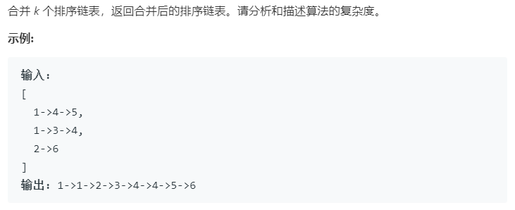

### 题目要求



### 解题思路

直接手撸即可。递归两两合并，可以缩短时间复杂度。

### 本题代码

```c++
class Solution {
public:
    ListNode* mergeKLists(vector<ListNode*>& lists) {
        if(lists.size() == 0)
            return NULL;
        if(lists.size() == 1)
            return lists[0];
        if(lists.size() == 2)
            return merge2lists(lists[0], lists[1]);
        vector<ListNode*>lists1;
        vector<ListNode*>lists2;
        int mid = lists.size() / 2;
        for(int i = 0;i < mid;i++)
            lists1.push_back(lists[i]);
        for(int i = mid;i < lists.size();i++)
            lists2.push_back(lists[i]);
        ListNode* l1 = mergeKLists(lists1);
        ListNode* l2 = mergeKLists(lists2);
        return merge2lists(l1, l2);
    }
    ListNode* merge2lists(ListNode* l1, ListNode* l2){
        ListNode* Head = new ListNode(0);
        ListNode* tail = Head;
        while(l1 != NULL && l2 != NULL){
            if(l1->val < l2->val){
                tail->next = l1;
                l1 = l1->next;
            }
            else{
                tail->next = l2;
                l2 = l2->next;
            }
            tail = tail->next;
        }
        tail->next = l1 != NULL ? l1 : l2;
        return Head->next;
    }
};
```

### [手撸测试](<https://leetcode-cn.com/problems/merge-k-sorted-lists/>) 

