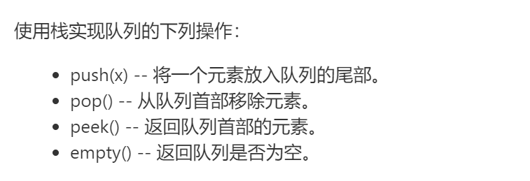

### 题目要求



### 解题思路

一个倒，一个装。

### 本题代码

```c++
class MyQueue {
public:
    /** Initialize your data structure here. */
    MyQueue() {
        
    }
    
    /** Push element x to the back of queue. */
    void push(int x) {
        stack<int>temp_data;
        while(!_data.empty()){
            temp_data.push(_data.top());
            _data.pop();
        }
        _data.push(x);
        while(!temp_data.empty()){
            _data.push(temp_data.top());
            temp_data.pop();
        }
    }
    
    /** Removes the element from in front of queue and returns that element. */
    int pop() {
        int x = _data.top();
        _data.pop();
        return x;
    }
    
    /** Get the front element. */
    int peek() {
        return _data.top();
    }
    
    /** Returns whether the queue is empty. */
    bool empty() {
        return _data.empty();
    }
    private:
    stack<int>_data;
};
```

### [手撸测试](https://leetcode-cn.com/problems/implement-queue-using-stacks/)  

