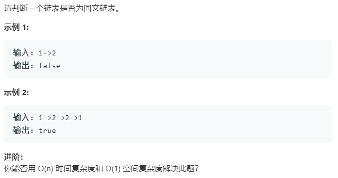

### 题目要求



### 解题思路

两种解法：快慢指针以及辅助栈。做**回文找中点**是自然而然的思路，那么快慢指针找中点在链表中是必会的小技能(尤其是奇偶数的处理)，然后将前面一半反转(可以即找中点又反转链表)，对比后一段。**辅助栈**可以只压入一半剩余直接弹出与原来的一半比较(注意奇偶数的处理)，也可以全部压然后从头判断。

### 本题代码

#### 快慢指针

```c++
class Solution {
public:
    bool isPalindrome(ListNode* head) {
        if(head == NULL || head->next == NULL)
            return true;
        ListNode* pre = NULL;
        ListNode* s = NULL;
        ListNode* slow = head;
        ListNode* fast = head;
        while(fast != NULL && fast->next != NULL){
            pre = slow;//跳出循环之后 pre在slow前一个
            slow = slow->next;
            fast = fast->next->next;
            pre->next = s;
            s = pre;
        }
        if(fast != NULL)//说明链表是一个奇数长
            slow = slow->next;
        while(pre != NULL){
            if(pre->val != slow->val)
                return false;
            else{
                pre = pre->next;
                slow = slow->next;
            }
        }
        return true;
    }
};
```

#### 辅助栈

```c++
class Solution {
public:
    bool isPalindrome(ListNode* head) {
        if(head == NULL)
            return true;
        stack<ListNode*>s;
        ListNode* node = head;
        while(node){
            s.push(node);
            node = node->next;
        }
        while(!s.empty()){
            if(s.top()->val != head->val)
                return false;
            head = head->next;
            s.pop();
        }
        return true;
    }
};
```

### [手撸测试](<https://leetcode-cn.com/problems/palindrome-linked-list/>) 

