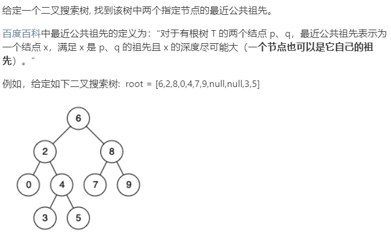

### 题目要求



### 解题思路

题很简单，完全考虑二叉搜索树的特性。当`p`和`q`都在一边时继续遍历该节点，当两个不在一边时那么当前节点即为公共节点。

### 本题代码

```c++
class Solution {
public:
    TreeNode* lowestCommonAncestor(TreeNode* root, TreeNode* p, TreeNode* q) {
        while(root){
            if(root->val > p->val && root->val > q->val){
                root = root->left;
                continue;
            }
            else if(root->val < p->val && root->val < q->val){
                root = root->right;
                continue;
            }
            else{
                return root;
            }
        }
        return NULL;
    }
};
```

### [手撸测试](https://leetcode-cn.com/problems/lowest-common-ancestor-of-a-binary-search-tree/) 

