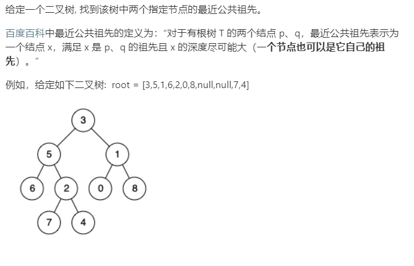

### 题目要求



### 解题思路

两种解法，一种常规解法，另外一种构建父节点以及该节点对应表，对表查公共节点。

常规解法的思路是：

> 采用的是后续遍历
>
> - 如果当前节点`cur`为空或者等于要查找的节点`p`或者`q`，那么直接返回该节点。
> - 后续遍历当前节点`cur`左节点和右节点，当这两个节点都不为空，说明左树或者右树出现了要查找的`p`和`q`，也就是说`p`和`q`上升的过程中首次在`cur`相遇，那么就直接返回当前节点`cur`。
> - 要是其中一个为空(如`node`为非空返回节点)，说明两种情况：要么`node`就是`p`或者`q`中的一个，要么`node`就是两者的公共祖先。

### 本题代码

#### 递归解法：

```c++
class Solution {
public:
    TreeNode* lowestCommonAncestor(TreeNode* root, TreeNode* p, TreeNode* q) {
        if(root == NULL || root == p || root == q)
            return root;
        TreeNode* left = lowestCommonAncestor(root->left, p, q);
        TreeNode* right = lowestCommonAncestor(root->right, p, q);
        if(left != NULL && right != NULL)
            return root;
        return left ? left : right;
    }
};
```

#### 非递归解法

```c++
class Solution {
public:
    TreeNode* lowestCommonAncestor(TreeNode* root, TreeNode* p, TreeNode* q) {
        vector<TreeNode*> path1, path2;
        getPath(root, p, path1);
        getPath(root, q, path2);
        int n = min(path1.size(), path2.size());
        TreeNode *last = nullptr;
        for (int i = 0; i < n; i++) {
            if (path1[i] != path2[i]) return last;
            last = path1[i];
        }
        return last;
    }
    void getPath(TreeNode* root, TreeNode* end, vector<TreeNode*>& path){
        stack<TreeNode*> stk;
        TreeNode *p = root, *prev = nullptr;
        while (p || !stk.empty()) {
            while (p) {
                stk.push(p);
                path.push_back(p);
                if (p == end) return;
                p = p->left;
            }
            p = stk.top();
            if (!p->right || p->right == prev) {
                path.pop_back();
                stk.pop();
                prev = p;
                p = nullptr;
            } else {
                p = p->right;
            }
        }
    }
};
```

### [手撸测试](<https://leetcode-cn.com/problems/lowest-common-ancestor-of-a-binary-tree/>) 

