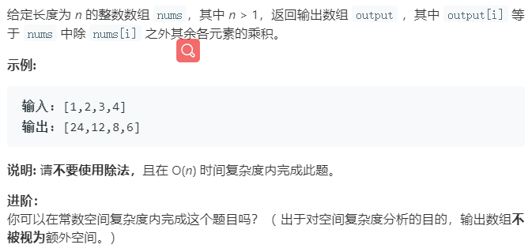

### 题目要求



### 解题思路

返回的数组每个位置`i`除了乘`nums[i]`其他的都乘。思路是两遍遍历：第一次从头，保整每次只乘先前以及下一位--完成乘以第`i`位以前所有数的乘积。第二次从尾，需要额外变量--完成乘以第`i`位以后所有位的乘积。

### 本题代码

```c++
class Solution {
public:
    vector<int> productExceptSelf(vector<int>& nums) {
        if(nums.size() == 0)
            return vector<int>();
        vector<int>res;
        res.push_back(1);
        for(int i = 0;i < nums.size() - 1;i++){
            res.push_back(res.back() * nums[i]);//正好错开一位，能把第i位置以前的都乘起来
        }
        int temp = 1;
        for(int i = nums.size() - 1;i >= 0;i--){
            res[i] *= temp;
            temp *= nums[i];//每次需要额外变量，能把第i位以后的都乘起来
        }
        return res;
    }
};
```

### [手撸测试](<https://leetcode-cn.com/problems/product-of-array-except-self/>)

