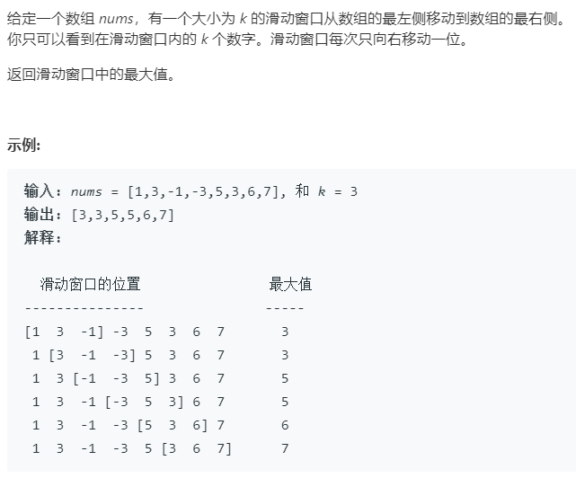

### 题目要求



### 解题思路

维护一个窗口大小为`k`的双端队列。该双端队列的头部值是该窗口的最大值下标，因此入队列是只要`nums[q.back()]`小于`nums[i]`。如果大于等于就需要一直尾部弹出队列直到队列为空或者满足入队条件。每次需要判断队列头部即`q.front()`两次--(1)是否是过期窗口最大值，也即`q.front() == i - k`（2）是否是当前窗口的最大值，即`i - w + 1 >= 0`。

### 本题代码

```c++
class Solution {
public:
    vector<int> maxSlidingWindow(vector<int>& nums, int k) {
        if(nums.size() == 0 || nums.size() < k || k < 1)
            return vector<int>();
        int n = nums.size();
        vector<int>res(n - k + 1);
        deque<int>q;
        int index = 0;
        for(int i = 0;i < nums.size();i++){
            while(!q.empty() && nums[q.back()] <= nums[i])
                q.pop_back();
            q.push_back(i);
            if(q.front() == i - k)
                q.pop_front();
            if(i - k + 1 >= 0)
                res[index++] = nums[q.front()];
        }
        return res;
    }
};
```

### [手撸测试](<https://leetcode-cn.com/problems/sliding-window-maximum/>) 
