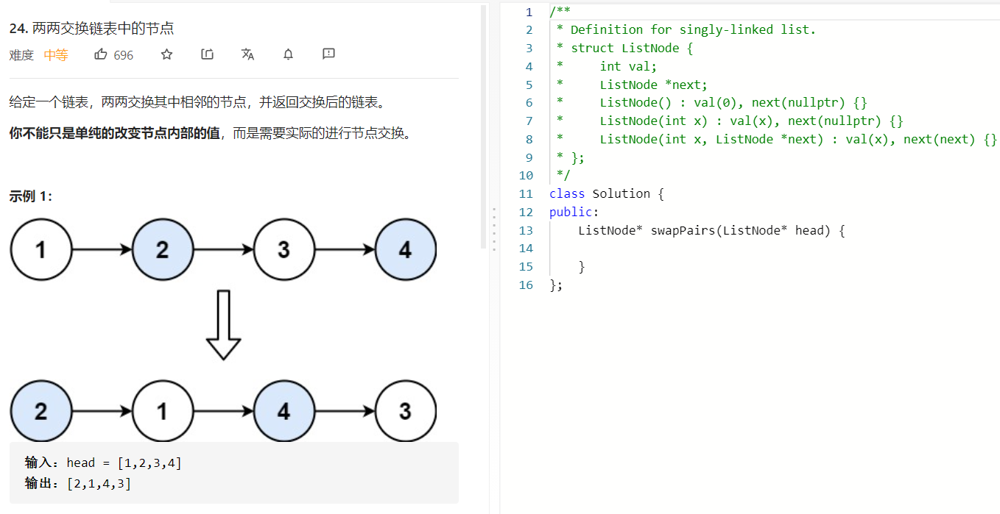

### 题目要求



### 解题思路

直接画图手撸即可。

### 本题代码

```c++
class Solution {
public:
    ListNode* swapPairs(ListNode* head) {
        if(head == NULL || head->next == NULL)
            return head;
        ListNode* res = head->next;
        ListNode* next = NULL;
        ListNode* cur = head;
        ListNode* pre = cur;
        while(cur != NULL && cur->next != NULL){
            next = cur->next->next;
            if(pre)
                pre->next = cur->next;
            cur->next->next = cur;
            cur->next = next;
            pre = cur;
            cur = next;

        }
        return res;
    }
};
```

### [手撸测试](https://leetcode-cn.com/problems/swap-nodes-in-pairs/)  

