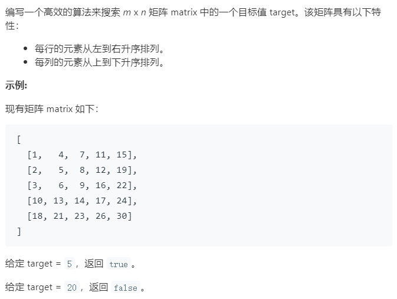

### 题目要求



### 解题思路

因为矩阵是排过序的，因此直接从右上角开始找，相等就返回`true`，大于目标值就往左走，小于目标值就往下走。如果遍历完没找到就返回`false`。

### 本题代码

```c++
class Solution {
public:
    bool searchMatrix(vector<vector<int>>& matrix, int target) {
        if(matrix.size() == 0)
            return false;
        int rows = matrix.size();
        int cols = matrix[0].size();
        int j = cols - 1;
        int i = 0;
        while(i < rows && j > -1){
            if(matrix[i][j] == target)
                return true;
            else if(matrix[i][j] > target)
                j--;
            else if(matrix[i][j] < target)
                i++;
        }
        return false;
    }
};
```

### [手撸测试](<https://leetcode-cn.com/problems/search-a-2d-matrix-ii/>)
