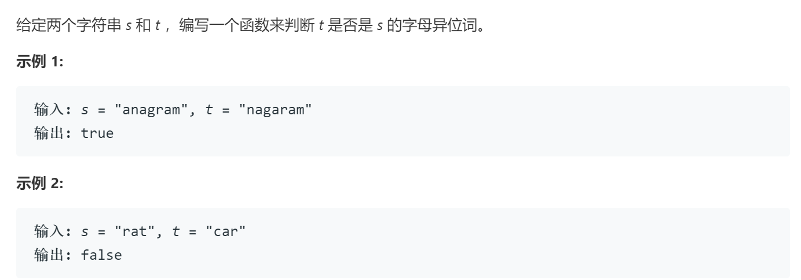

### 题目要求



### 解题思路

用`hash`一次便利记录单词，然后根据记录的`hash`判断另一个单词。

### 本题代码

```c++
class Solution {
public:
    bool isAnagram(string s, string t) {
        if(s.size() != t.size())
            return false;
        vector<int>table;
        table.resize(26,0);
        for(char c:s){
            table[c-'a']++;
        }
        for(char c:t){
            table[c-'a']--;
            if(table[c-'a'] < 0)
                return false;
        }
        return true;
    }
};
```

### [手撸测试](https://leetcode-cn.com/problems/valid-anagram/)  

