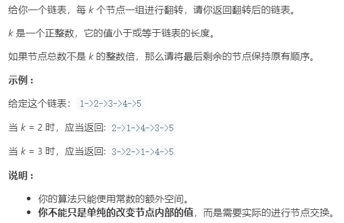

### 题目要求



### 解题思路

直接法。直接遍历链表，满足`k`的要求后反转，因此在遍历中需要记住四个位置：开始反转的位置`start`、反转结束的位置`cur`、反转前一个位置`pre`以及反转结束的下一个位置`next`。将`start`和`cur`之间的位置反转后，将`pre`和`cur`链接，将`start`和`next`链接，最后把`pre`移到`start`，`cur`移动到`next`开始下一次反转。

### 本题代码

```c++
class Solution {
public:
    ListNode* reverseKGroup(ListNode* head, int k) {
        if(k <= 1 || head == NULL)
            return head;
        ListNode* cur = head;
        ListNode* start = NULL;
        ListNode* pre = NULL;
        ListNode* next = NULL;
        int sum = 1;
        while(cur != NULL){
            next = cur->next;
            if(sum == k){
                start = pre == NULL ? head : pre->next;
                head = pre == NULL ? cur : head;//针对头一个节点
                myreverse(pre, start, cur, next);
                pre = start;
                sum = 0;
            }
            sum++;
            cur = next;
        }
        return head;
    }
    void myreverse(ListNode* left, ListNode* start, ListNode* end, ListNode* right){
        //left是反转前一个节点，right是反转后一个节点
        //start是开始反转的节点，end是最后要反转的节点
        ListNode* pre = start;
        ListNode* next = NULL;
        ListNode* cur = start->next;
        while(cur != right){
            next = cur->next;
            cur->next = pre;
            pre = cur;
            cur = next;
        }
        if(left != NULL)
            left->next = end;
        start->next = right;
    }
};
```

### [手撸测试](<https://leetcode-cn.com/problems/reverse-nodes-in-k-group/>) 

