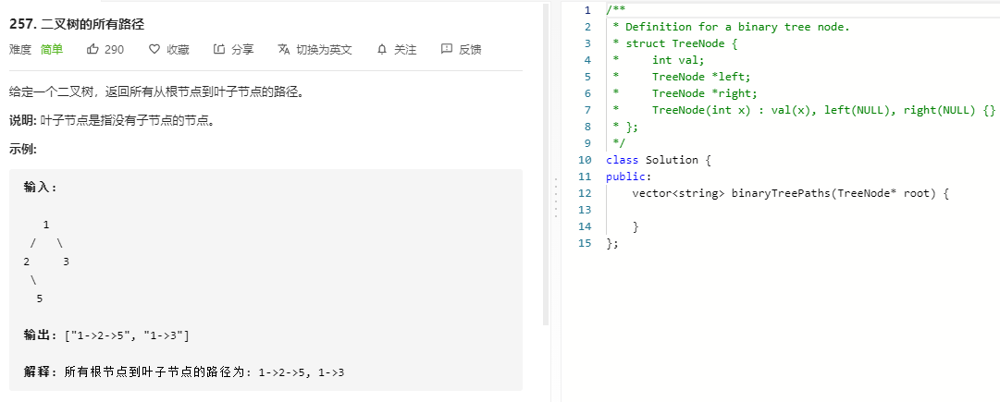

### 题目要求



### 解题思路

典型的DFS+回溯。整体框架就是add+search+remove。

### 本题代码

```c++
class Solution {
public:
    vector<string> binaryTreePaths(TreeNode* root) {
        vector<string>res;
        string path;
        dfs(root, res, path);
        return res;
    }
    void dfs(TreeNode* root, vector<string>& res, string path){
        if(root == NULL)
            return;
        int len = path.size();
        path += to_string(root->val);
        if(root->left == NULL && root->right == NULL){
            res.push_back(path);
        }
        path += "->";
        dfs(root->left, res, path);
        dfs(root->right, res, path);
        path = path.substr(0, len);
    }
};
```

### [手撸测试](https://leetcode-cn.com/problems/binary-tree-paths/)  

