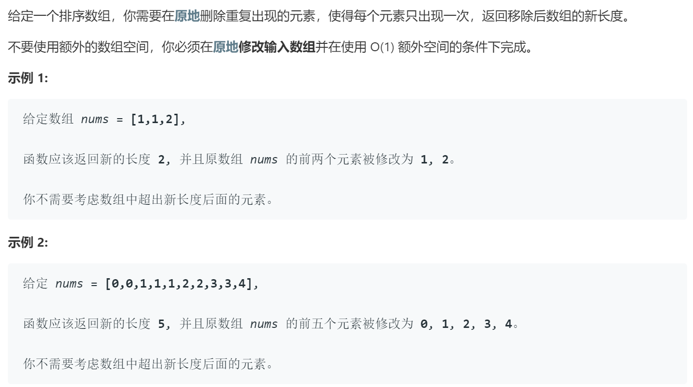

### 题目要求



### 解题思路

快慢指针的思路。定义两个指针`i`和`j`，当两个指针内容相同的时候，`j`往后走；不相等时`i`往后走，并且把`nums[j]`赋值给`nums[i]`。

### 本题代码

```c++
class Solution {
public:
    int removeDuplicates(vector<int>& nums) {
        if(nums.size() == 0)
            return 0;
        int i = 0;
        for(int j = 1;j < nums.size();j++){
            if(nums[i] != nums[j]){
                i++;
                nums[i] = nums[j];
            }
        }
        return i + 1;
    }
};
```

### [手撸测试](https://leetcode-cn.com/problems/remove-duplicates-from-sorted-array/)  

