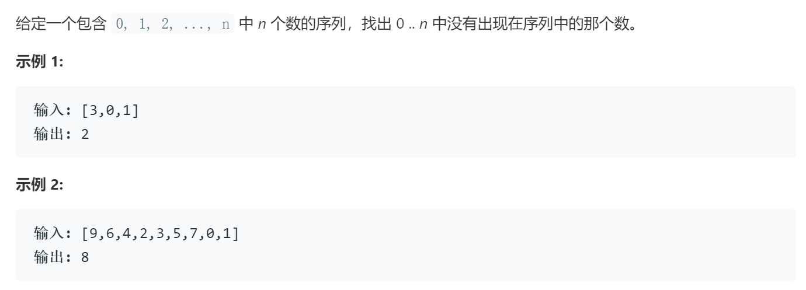

### 题目要求



### 解题思路

利用异或的方法得到最后的结果。

### 本题代码

```c++
class Solution {
public:
    int missingNumber(vector<int>& nums) {
        if(nums.size() == 0)
            return 0;
        int res = 0;
        for(int i = 0;i < nums.size();i++){
            res ^= nums[i] ^ i;
        }
        res ^= nums.size();//这里要注意不要漏掉n
        return res;
    }
};
```

### [手撸测试](https://leetcode-cn.com/problems/missing-number/)  

