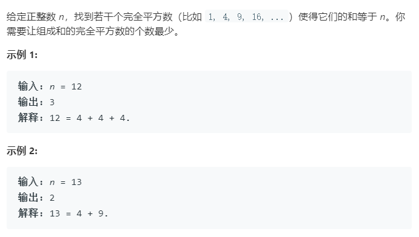
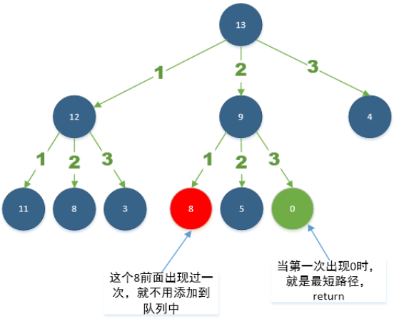

### 题目要求



### 解题思路

#### 解法一 动态规划

推导动态方程：$$m=f(n)$$，其中$$m$$是满足正整数$$n$$的最小的完全平方数最合个数。假设$$k$$是满足最小$$m$$的最大平方数，那么$$f(n) = f(k*k) + f(n - k*k)$$，也即$$f(n) = 1 + f(n - k*k)$$，所以动态规划的解法是创建一个$$dp[n+1]$$的数组，动态规划方程是$$dp[i] = min(dp[i], dp[i - k * k]+1)$$，其中$$dp[i]$$最坏的情况$$i$$个1也就是动态方程的初始化为$$dp[i] = i$$。

#### 解法二 广度优先遍历



维护一个树，树中的节点类包含两个属性(1)val；可以理解为是下一个节点；(2)step。

### 本题代码

#### 解法一 动态规划

```c++
class Solution {
public:
    int numSquares(int n) {
        vector<int>dp(n + 1, 0);
        for(int i = 1;i <= n;i++){
            dp[i] = i;
            for(int j = 1;i - j*j >=0;j++){
                dp[i] = min(dp[i], dp[i - j*j] + 1);
            }
        }
        return dp[n];
    }
};
```

#### 解法二 广度优先遍历

```c++
class Node{
    public:
    int val;
    int step;
    Node(int value, int s){
        val = value;
        step = s;
    }
};
class Solution {
public:
    int numSquares(int n) {
        queue<Node*>q;
        Node* root = new Node(n, 1);
        q.push(root);
        vector<int>visit(n, 0);
        while(!q.empty()){
            int val = q.front()->val;
            int step = q.front()->step;
            q.pop();
            // 每一层的广度遍历
            for(int i = 1;;i++){
                int nexVal = val - i * i;//往下遍历的节点
                if(nexVal < 0)// 说明已到最大平方数
                    break;
                if(nexVal == 0)// 由于是广度遍历，所以当遍历到0时，肯定是最短路径
                    return step;
                // 当再次出现时没有必要加入，因为在该节点的路径长度肯定不小于第一次出现的路径长
                if(visit[nexVal] == 0){
                    q.push(new Node(nexVal, step + 1));
                    visit[nexVal] = 1;
                }
            }
        }
        return -1;
    }
};
```

### [手撸测试](<https://leetcode-cn.com/problems/perfect-squares/>) 

