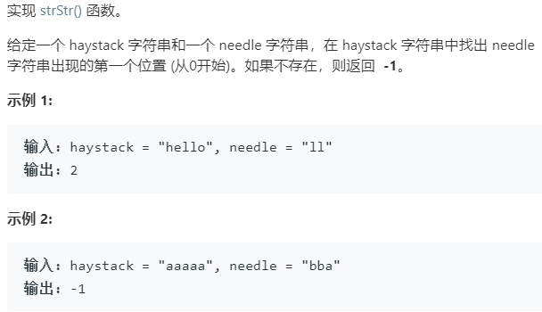

### 题目要求



### 解题思路

直接暴力解法，时间复杂度是$$O(n * k)$$，`n`是`haystack`的长度，`k`是`needle`的长度。每次遍历如果该位置子符相等继续遍历，如果不相等`i`就倒回去，`j`清零继续遍历。

### 本题代码

```c++
class Solution {
public:
    int strStr(string haystack, string needle) {
        if(needle.size() == 0)
            return 0;
        int i = 0;
        int j = 0;
        while(i < haystack.size() && j < needle.size()){
            if(haystack[i] == needle[j]){
                i++;
                j++;
            }
            else{
                i = i - j + 1;
                j = 0;
            }
        }
        if(j == needle.size())
            return (i - j);
        return -1;
    }
};
```

### [手撸测试](<https://leetcode-cn.com/problems/implement-strstr/>) 
