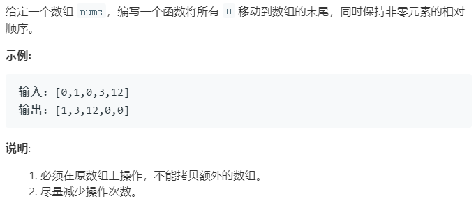

### 题目要求



### 解题思路

简单题，题目意思就是说将非0元素提前即可。

### 本题代码

```c++
class Solution {
public:
    void moveZeroes(vector<int>& nums) {
        if(nums.size() == 0)
            return;
        int index = 0;
        for(int i = 0;i < nums.size();i++){
            if(nums[i] != 0)
                nums[index++] = nums[i];
        }
        while(index < nums.size()){
            nums[index] = 0;
            index++;
        }
    }
};
```

### [手撸测试](<https://leetcode-cn.com/problems/move-zeroes/>)
