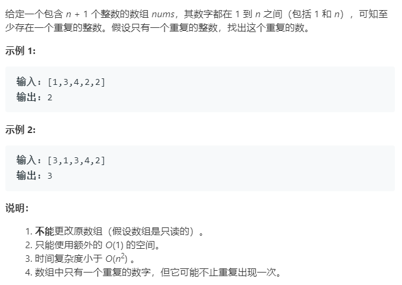

### 题目要求



### 解题思路

如果没有限制条件，最容易想到的做法是--(1)排序之后检查相邻；(2)利用hash计数。有空间时间复杂度的限制条件之后，两种做法--(1)数组环形trick；(2)二分法。

#### 建模环形数组

所谓环形数组指的是如果将数组的索引作为节点，把数组值作为节点跳转的位置，那么数组就可以看成链表。如`nums = [1,3,2,4,3]`索引0上的值是1所以它会指向`nums[1]`也就是3，那么3就会指向索引3也就是`nums[4]`也就是3，而`nums[4]`上还是3，他就会指向`nums[3]`，这样就会形成一个环。思路清楚后，那么剩余的接题过程就跟环形链表找入口一样了。

#### 二分法

这个二分法就很奇特。回到原问题，数组中的数都是`1~n`之间，如果没有重复数那么数组长度是`n`，那么就不管数组是否排过序，直接找`1`和`n`的中点的数`mid`然后看比该中点小的有几个就知道重复的侧重于那一边(因为没有重复的话，比`mid`小的只有`mid`个)。这种思路就不在乎数组是否排过序，因为数组中的数都是`1~n`之间。当小于中点的个数`count`大于`mid`那么搜索范围一定在`1~mid`之间否在就在`(mid + 1) ~ n`之间。

### 本题代码

#### 解法一 建模环形数组

```c++
class Solution {
public:
    int findDuplicate(vector<int>& nums) {
        if(nums.size() == 0)
            return -1;
        int fast = 0;
        int slow = 0;
        while(true){
            fast = nums[nums[fast]];
            slow = nums[slow];
            if(fast == slow)
                break;//找到相遇点，但是未必是入口
        }
        fast = 0;
        while(true){
            fast = nums[fast];
            slow = slow[slow];
            if(fast == slow)
                break;//找到环形入口
        }
        return slow;
    }
};
```

#### 解法二 二分法

```c++
class Solution {
public:
    int findDuplicate(vector<int>& nums) {
        int left = 0;
        int right = nums.size() - 1;
        while(left < right){
            int mid = (left + right) >> 1;
            int count = 0;
            for(auto num : nums){
                if(num <= mid)//注意这里
                    count++;
            }
            if(count > mid)
                right = mid;
            else
                left = mid + 1;
        }
        return left;
    }
};
```

### [手撸测试](<https://leetcode-cn.com/problems/find-the-duplicate-number/>)

