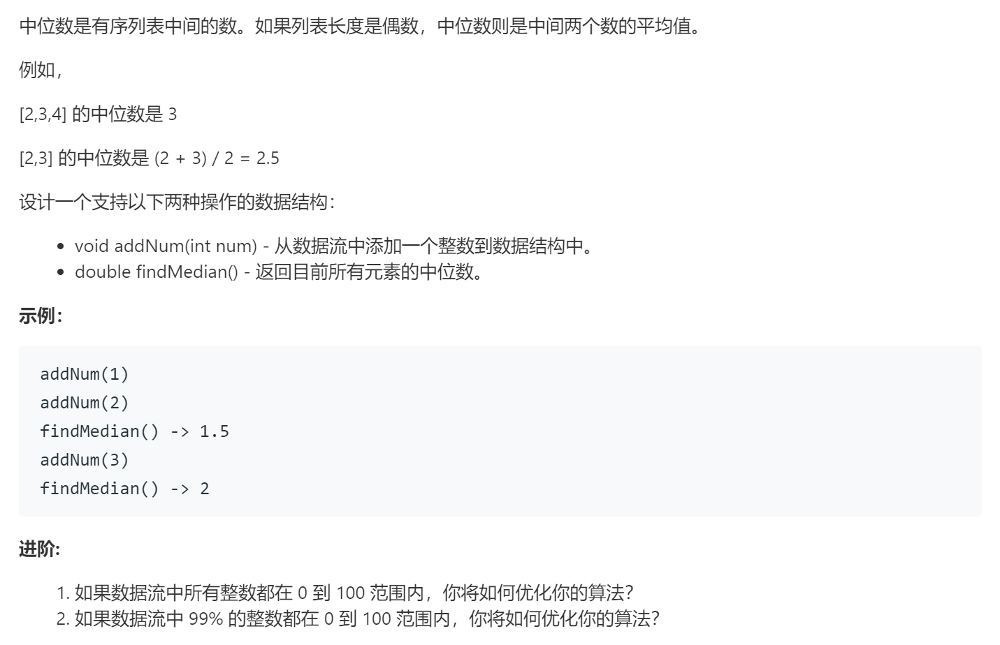

### 题目要求



### 解题思路

参考[思路](offer41.md) 

### 本题代码

```c++
class MedianFinder {
public:
    /** initialize your data structure here. */
    MedianFinder() {

    }
    
    void addNum(int num) {
        low.push(num);
        heigh.push(low.top());
        low.pop();
        if(low.size() < heigh.size()){
            low.push(heigh.top());
            heigh.pop();
        }
    }
    
    double findMedian() {
        double res = low.size() > heigh.size() ? double(low.top()) : double((low.top() + heigh.top()) * 0.5);
        return res;
    }
    private:
    priority_queue<int, vector<int>, less<int>>low;
    priority_queue<int, vector<int>, greater<int>>heigh;
};

/**
 * Your MedianFinder object will be instantiated and called as such:
 * MedianFinder* obj = new MedianFinder();
 * obj->addNum(num);
 * double param_2 = obj->findMedian();
 */
```

### [手撸测试](https://leetcode-cn.com/problems/find-median-from-data-stream/)  

