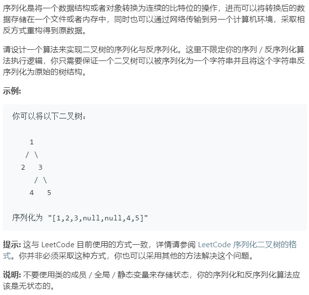

### 题目要求



### 解题思路

递归以及非递归的方法都可以解决。但主要是细节需要细细揣摩，这里代码只列出层级遍历的解法。

序列化：广度优先搜索按层级的话，标识层级结束有个小细节使用`count = q.size()`的方法`q`是广度优先搜索所用的队列。另外，当节点为空时，返回的`str`加入的是字符`#`，数字的话直接调用库函数`to_string()`再加上`!`。

反序列化：当输入的`data`不为空时，`i = 0, j = 0`，`j`往右遍历先找到第一个`!`处，然后使用库函数`stoi`将`data.substr(i, j - i)`变成整数创建根节点，接着压入广度优先搜素的队列中。从`i`开始遍历，遇到`#`标识符创建空节点，压入队列中，遇到`!`就创建节点，分左右压入队列中(这里的操作代码一样，只是压入的顺序不同)。每次遍历一个节点，为空就直接继续，不为空就开始创建左右节点。

### 本题代码

```c++
class Codec {
public:

    // Encodes a tree to a single string.
    string serialize(TreeNode* root) {
        string str;
        if(root == NULL)
            return str;
        queue<TreeNode*>q;
        q.push(root);
        while(!q.empty()){
            int count = q.size();
            while(count--){
                TreeNode* node = q.front();
                q.pop();
                if(node == NULL){
                    str += '#';
                }
                else{
                    str += to_string(node->val) + '!';
                    q.push(node->left);
                    q.push(node->right);
                }
            }
        }
        return str;
    }

    // Decodes your encoded data to tree.
    TreeNode* deserialize(string data) {
        if(data.size() == 0)
            return NULL;
        int i = 0;
        int j = 0;
        while(j < data.size() && data[++j] != '!');
        TreeNode* head = new TreeNode(stoi(data.substr(i,j-i)));
        queue<TreeNode*>q;
        q.push(head);
        while(i < data.size()){
            TreeNode* node = q.front();
            q.pop();
            if(node == NULL)
                continue;
            //左节点
            i = ++j;
            if(i >= data.size())
                break;
            if(data[i] == '#')
                node->left = NULL;
            else{
                while(j < data.size() && data[++j] != '!');
                node->left = new TreeNode(stoi(data.substr(i,j-i)));
            }
            q.push(node->left);
            //右节点
            i = ++j;
            if(i >= data.size())
                break;
            if(data[i] == '#')
                node->right = NULL;
            else{
                while(j < data.size() && data[++j] != '!');
                node->right = new TreeNode(stoi(data.substr(i,j-i)));
            }
            q.push(node->right);
        }
        return head;
    }
};
```

### [手撸测试](<https://leetcode-cn.com/problems/serialize-and-deserialize-binary-tree/>) 
