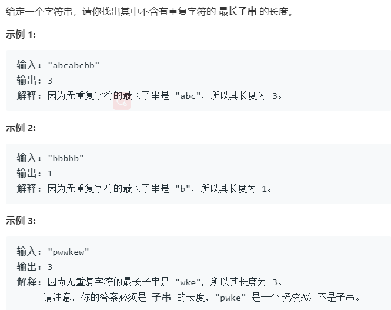

### 题目要求



### 解题思路

要求是找到字符串中的**最长连续不重复子串**，而不是最长子序列。思路是维护双指针`start`以及`end`。当遍历到当前位置`end`时，检查`start`到`end`之间是否有重复，如果有就更新`start`返回记录最大长度并且`end`继续往右走，如果一直没有那么`start`就不会更新但也会计算最大长度并且`end`继续往右走。

### 本题代码

```c++
class Solution {
public:
    int lengthOfLongestSubstring(string s) {
        int start = 0;
        int end = 0;
        int res = 0;
        for(;end < s.size();end++){
            for(int k = start;k < end;k++){
                if(s[k] == s[end]){
                    start = k + 1;
                    break;
                }
            }
            res = max(res, end - start + 1);
        }
        return res;
    }
};
```

### [手撸测试](<https://leetcode-cn.com/problems/longest-substring-without-repeating-characters/>)
