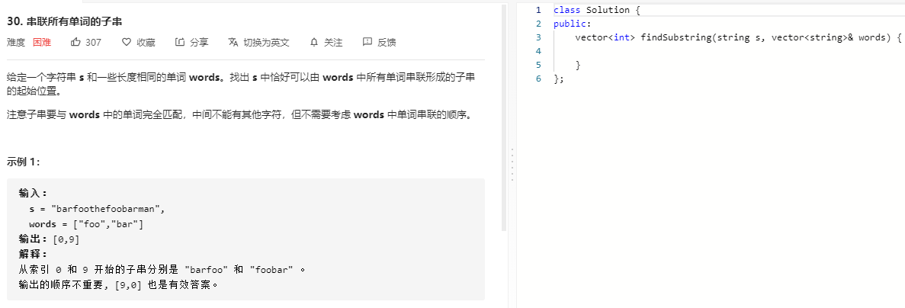

### 题目要求



### 解题思路

滑动窗口。注意题目中是每一个word的长度都相同。

### 本题代码

```c++
class Solution {
public:
    vector<int> findSubstring(string s, vector<string>& words) {
        if(s.size() == 0 || words.size() == 0)
            return vector<int>();
        int wordsize = words[0].size();
        int wordnums = words.size();
        unordered_map<string, int>m;
        for(auto word: words)
            m[word]++;
        unordered_map<string, int>window;
        vector<int>res;
        for(int i = 0;i + wordsize*wordnums <= s.size();i++){
            int j = i;
            for(;j < (i + wordsize*wordnums);j += wordsize){
                string temp = s.substr(j, wordsize);
                if(m.count(temp) == 0) //和最长重复字串一样有一个不行就直接跳出
                    break;
                else{
                    window[temp]++;
                    if(m[temp] < window[temp])
                        break;
                }
            }
            if(j == (i + wordsize*wordnums))
                res.push_back(i);
            window.clear();
        }
        return res;
    }
};
```

### [手撸测试](https://leetcode-cn.com/problems/substring-with-concatenation-of-all-words/)  

