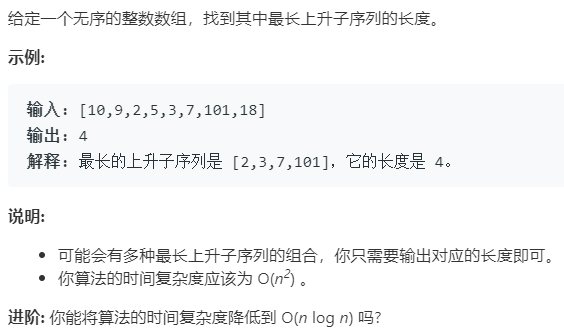

### 题目要求



### 解题思路

典型的动态规划就可以做出来的。首先动态规划方程是$$dp[i] = max(dp[j]) + 1$$，这里的$$dp[j]$$指的是`j`小于`i`时。因此代码就很简单可以撸出来(注意max的位置，所以需要中间变量保存下)。进阶的方法是指的是二分法，还是比较难的，这里就先空下，等有机会了在撸出来。

### 本题代码

```c++
class Solution {
public:
    int lengthOfLIS(vector<int>& nums) {
        if(nums.size() == 0)
            return 0;
        int dp[n] = {0};
        dp[0] = 1;
        int maxres = 0;
        for(int i = 0;i < nums.size();i++){
            int maxval = 0;
            for(int j = 0;j < i;j++){
                if(nums[j] < nums[i])
                    maxval = max(maxval, dp[j]);
            }
            dp[i] = maxval + 1;
            maxres = max(maxres, dp[i]);
        }
        return maxres;
    }
};
```

### [手撸测试](<https://leetcode-cn.com/problems/longest-increasing-subsequence/>) 
