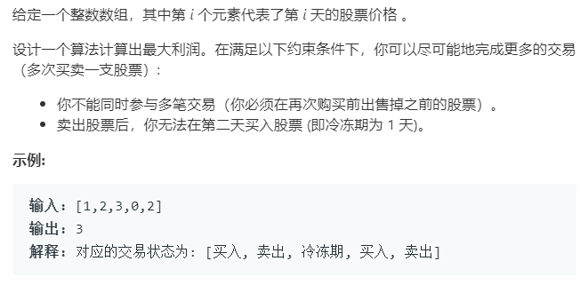

### 题目要求



### 解题思路

整体的解题思路一定要参考[`labuladong`](<https://blog.csdn.net/b515833/article/details/93927055>)老哥写的一套团灭股票买卖问题的大纲。这道题就是动态规划，也可以从状态转移情况中将动态方程搞出来。其中`prices[n]`数组中是每天的股票价格，我们有两个状态数组`hold[n]`和`unhold[n]`，表示的是第`i`持有或者不持有股票的最大利益。如果第`i`天我持有股票，我的最大利益可以是(1)第`i-1`天(昨天)我依旧持有股票今天我不做任何操作(冻结)；(2)要么是我昨天没有持有股票今天买入，那意味着第`i-2`天(前天)我是已经抛售了股票--导致昨天不持有，才今天买入。因此第`i`天持有股票的动态方程是$$hold[i] = max(hold[i - 1], unhold[i - 2] - prices[i])$$，注意买入是利益减去今天股票价格。如果第`i`天我没有持有股票，我的最大利益可以是(1)第`i-1`天我持有今天我卖出；(2)要么是我昨天也没有持有，今天啥也不做。因此第`i`天不持有股票的动态方程是$$unhold[i] = max(hold[i - 1] + prices[i], unhold[i])$$。关于初始值的设置详情可以参考代码注释。

### 本题代码

```c++
class Solution {
public:
    int maxProfit(vector<int>& prices) {
        if(prices.size() == 0 || prices.size() == 1)
            return 0;
        vector<int>hold(prices.size(), 0);
        hold[0] = -prices[0];//第0天持有股票 那收益就是0-prices[0]；
        hold[1] = max(-prices[0], -prices[1]);//第1天持有股票，收益是要么第0天买入，要么第1天买入
        vector<int>unhold(prices.size(), 0);
        unhold[0] = 0;
        unhold[1] = max(0, prices[1] - prices[0]);//如果第1天不持有，要么都没买入，要么就是第0天买入第1天卖出
        if(prices.size() == 2)
            return max(hold[1], unhold[1]);
        int res = INT_MIN;
        for(int i = 2;i < prices.size();i++){
            //如果当天持有，要么就是昨天也持有，那就什么都不做最大利益是昨天持有的，
            //要么是当天买入--昨天已经是不持有，也就是说前天就已经抛售
            hold[i] = max(hold[i - 1], unhold[i - 2] - prices[i]);
            unhold[i] = max(hold[i - 1] + prices[i], unhold[i - 1]);
            res = max(res, max(hold[i], unhold[i]));
        }
        return res;
    }
};
```

### [手撸测试](<https://leetcode-cn.com/problems/best-time-to-buy-and-sell-stock-with-cooldown/>)
