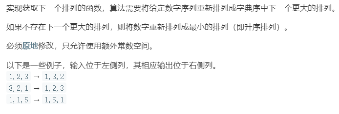

### 题目要求



### 解题思路

对于任意一个序列，我们从后往前找，先找到一个最长递减子序列，比如`2 1 7 5 4 3`，那么最长递减子序列就是`7 5 4 3`，把它逆序，变成`3 4 5 7`，这是最小序列，这时整个序列变成了`2 1 3 4 5 7`。这样还不够，我们还要满足比原序列的字典序大，其实也好处理，最长递减子序列的前一个元素是`1`，我们只需要在最小的序列`3 4 5 7`中找一个比它大并且最接近它的元素，将它换掉就可以了，显然这个替换的元素是`3`（替换并没有破坏最小序列的单调性），这样整个序列就变成了`2 3 1 4 5 7`，这也就是我们的目标序列。

### 本题代码

```c++
class Solution {
public:
    void nextPermutation(vector<int>& nums) {
        int i = nums.size() - 2;
        while(i >= 0 && nums[i + 1] <= nums[i])
            i--;
        if(i >= 0){
            int j = nums.size() - 1;
            while(j >= 0 && nums[j] <= nums[i]){
                j--;
            }
            swap(nums, i, j);
        }
        reverse(nums, i + 1);
    }
    void swap(vector<int>& nums, int i, int j){
        int temp = nums[i];
        nums[i] = nums[j];
        nums[j] = temp;
    }
    void reverse(vector<int>& nums, int start){
        int end = nums.size() - 1;
        while(start < end){
            swap(nums, start, end);
            start++;
            end--;
        }
    }
};
```

### [手撸测试](<https://leetcode-cn.com/problems/next-permutation/>) 

