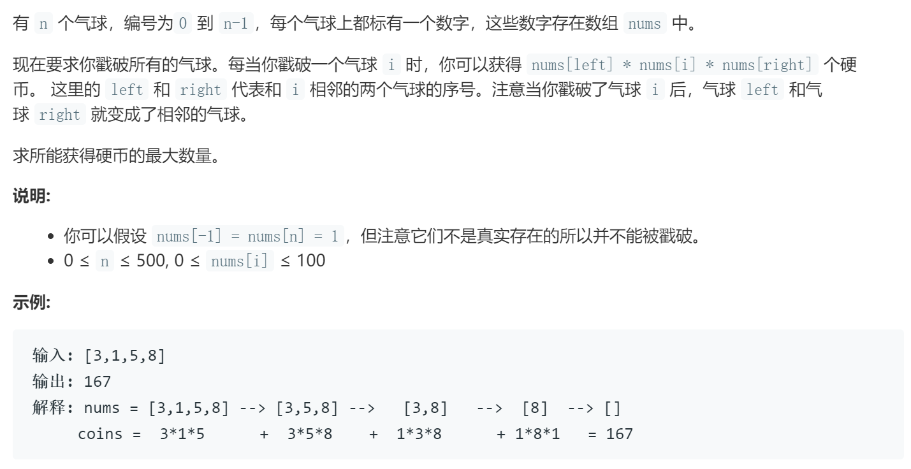

### 题目要求



### 解题思路

动态规划，思路是：**`dp[i][j]`表示双开区间`(i,j)`的最大得分**，如果假设戳破的气球是`k`，那么动态规划的方程就是$$dp[i][j] = max(dp[i][j], dp[i][k] + dp[k][j] + points[i]*points[k]*points[j])$$。其中为了防止越界改造`nums`为`points`数列--就是左右加上1，中间的值不变。遍历的时候`i`从下往上，`j`从左往右，`k`从`i+1`到`j`(取不到)。

### 本题代码

```c++
class Solution {
public:
    int maxCoins(vector<int>& nums) {
        if(nums.size() == 0)
            return 0;
        int n = nums.size();
        vector<int>points(n+2, 0);
        points[0] = points[n+1] = 1;
        for(int i = 1;i <= n;i++){
            points[i] = nums[i-1];
        }
        vector<vector<int>>dp(n+2, vector<int>(n+2, 0));
        for(int i = n;i >= 0;i--){ // 倒着更新慢慢扩展到0~n+1 
            for(int j=i+1;j < n+2;j++){
                for(int k=i+1;k < j;k++){
                    dp[i][j] = max(dp[i][j], dp[i][k] + dp[k][j] + points[k]*points[i]*points[j]);
                }
            }
        }
        return dp[0][n+1];
    }
};
```

### [手撸测试](https://leetcode-cn.com/problems/burst-balloons/) 
