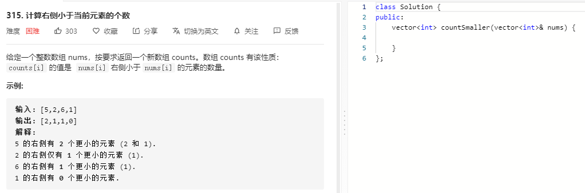

### 题目要求



### 解题思路

逆序树问题，解法有归并排序以及树状数组。归并排序，基础手撸做法但是在前序或者后序元素出列时统计右边比其小的元素，可以画个图如果选定前序出栈，那么右边比其小的元素个数就是后续已经出序的个数。

### 本题代码

```c++
class Solution {
public:
    vector<int> countSmaller(vector<int>& nums) {
        if(nums.size() == 0)
            return vector<int>();
        vector<pair<int, int>>vec;
        vector<int>res;
        for(int i = 0;i < nums.size();i++){
            res.push_back(0);
            vec.push_back(make_pair(nums[i], i));
        }
        merge(vec, res);
        return res;
    }
    void merge(vector<pair<int, int>>& vec, vector<int>& res){
        if(vec.size() < 2)
            return;
        vector<pair<int, int>>sub_1;
        vector<pair<int, int>>sub_2;
        int mid = vec.size() / 2;
        for(int i = 0;i < mid;i++)
            sub_1.push_back(vec[i]);
        for(int i = mid;i < vec.size();i++)
            sub_2.push_back(vec[i]);
        merge(sub_1, res);
        merge(sub_2, res);
        vec.clear();
        merge2vec(vec, sub_1, sub_2, res);
    }
    void merge2vec(vector<pair<int, int>>& vec, vector<pair<int, int>>& sub_1, vector<pair<int, int>>& sub_2, vector<int>& res){
        int i = 0, j = 0;
        while(i < sub_1.size() && j < sub_2.size()){
            if(sub_1[i].first <= sub_2[j].first){
                vec.push_back(sub_1[i]);
                res[sub_1[i].second] += j;
                i++;
            }
            else{
                vec.push_back(sub_2[j]);
                j++;
            }
        }
        for(;i < sub_1.size();i++){
            vec.push_back(sub_1[i]);
            res[sub_1[i].second] += j;
        }
        for(;j < sub_2.size();j++){
            vec.push_back(sub_2[j]);
        }
    }
};
```

### [手撸测试](https://leetcode-cn.com/problems/count-of-smaller-numbers-after-self/) 
