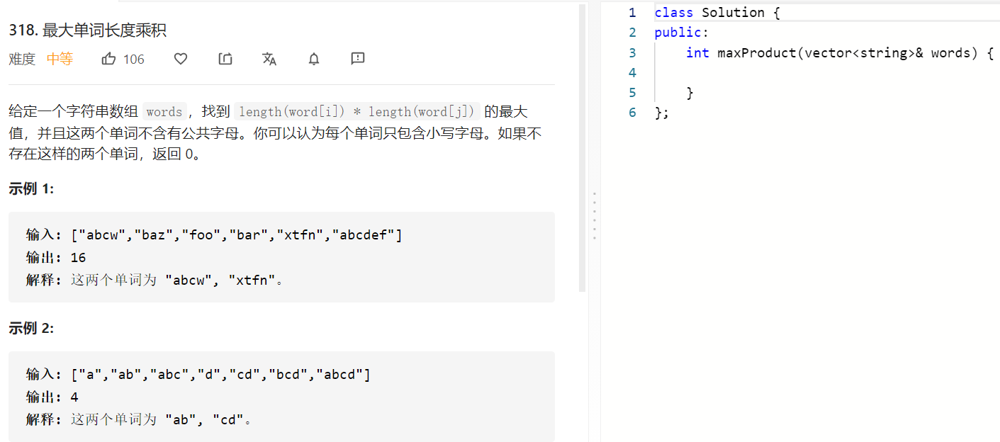

### 题目要求



### 解题思路

可以将单词转换成二进制来判断是偶相同然后计算长度大小。

### 本题代码

```c++
class Solution {
public:
    int maxProduct(vector<string>& words) {
        vector<int>sign_vec;
        for(auto word: words){
            int sign = 0;
            for(int i = 0;i < word.size();i++){
                sign |= (1 << (word[i] - 'a'));
            }
            sign_vec.push_back(sign);
        }
        int res = 0;
        for(int i = 0;i < words.size();i++){
            for(int j = i+1;j < words.size();j++){
                if(!(sign_vec[i] & sign_vec[j])){
                    res = res > (words[i].size() * words[j].size())?res:words[i].size() * words[j].size();
                }
            }
        }
        return res;
    }
};
```

### [手撸测试](https://leetcode-cn.com/problems/maximum-product-of-word-lengths/)  

