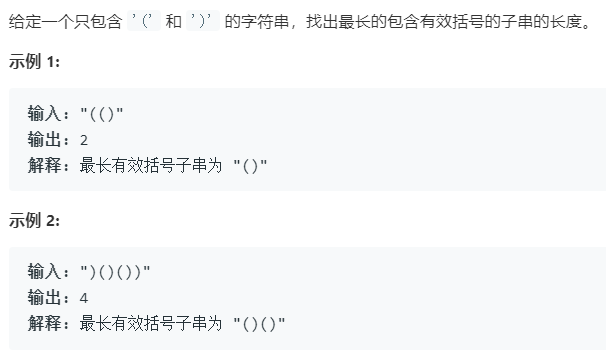

### 题目要求



### 解题思路

使用栈`sk`，每此遇到`)`就判断最大长度，当前索引减去栈顶，但是有种特殊情况--为了防止第一次就出现`)`的情况需要将`sk`初始化压入`-1`；若是遇到`(`就直接压入栈里。

### 本题代码

```c++
class Solution {
public:
    int longestValidParentheses(string s) {
        if(s.size() == 0)
            return 0;
        int res = 0;
        stack<int>sk;
        sk.push(-1);
        for(int i = 0;i < s.size();i++){
            if(s[i] == '(')
                sk.push(i);
            else{
                sk.pop();
                if(sk.empty())
                    sk.push(i);
                res = max(res, i - sk.top());
            }
        } 
        return res;
    }
};
```

### [手撸测试](<https://leetcode-cn.com/problems/longest-valid-parentheses/>) 

