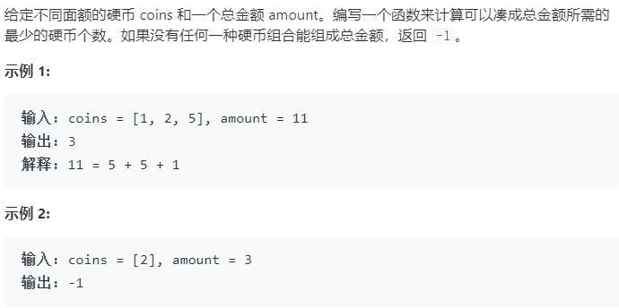

### 题目要求



### 解题思路

典型的动态规划问题。转移方程为：$$dp[i] = 1 + min\{dp[i - coins_1], dp[i - coins_2],...,dp[i - coins_n]\}$$，自然中括号中的只要为正数。另外动态规划表的初始化问题，每一个从`1`到`amount`的目标值最大零钱数为`amount`(全用`1`)，那么就设置为`amount + 1`,如果最后动态规划表`dp[amount]`大于`amount`那么肯定是无法凑够目标值。

### 本题代码

```c++
class Solution {
public:
    int coinChange(vector<int>& coins, int amount) {
        vector<int>dp(amount + 1, amount + 1);
        dp[0] = 0;
        for(int i = 1;i <= amount;i++){
            for(auto coin : coins){
                if(i >= coin){
                    dp[i] = min(dp[i], dp[i - coin] + 1);
                }
            }
        }
        return dp[amount] > amount ? -1 : dp[amount];
    }
};
```

### [手撸测试](<https://leetcode-cn.com/problems/coin-change/>) 

