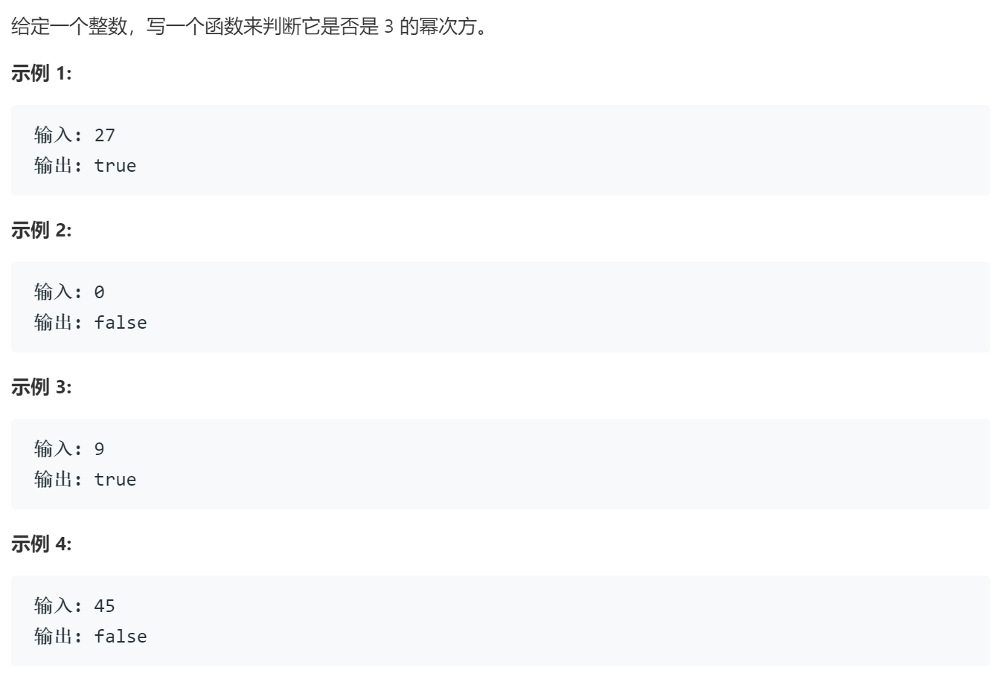

### 题目要求



### 解题思路

直接法，只要是`n%3==0`就将`n/3`，最后判断`n==1`。

### 本题代码

```c++
class Solution {
public:
    bool isPowerOfThree(int n) {
        if(n < 1)
            return false;
        while(n % 3 == 0){
            n /= 3;
        }
        return n == 1;
    }
};
```

### [手撸测试](https://leetcode-cn.com/problems/power-of-three/)  

