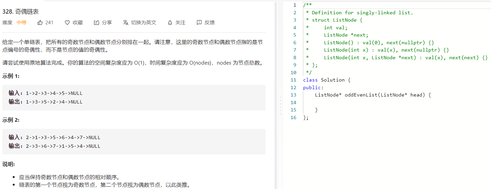

### 题目要求



### 解题思路

不仅要考虑当前的odd的位置还要考虑even的位置。在纸上画一下就可以解。

### 本题代码

```c++
class Solution {
public:
    ListNode* oddEvenList(ListNode* head) {
        if (head == NULL) 
            return NULL;
        ListNode* odd = head;
        ListNode* even = head->next;
        ListNode* evenHead = even;
        while (even != NULL && even->next != NULL){
            odd->next = even->next;
            odd = odd->next;
            even->next = odd->next;
            even = even->next;
        }
        odd->next = evenHead;
        return head;
    }
};
```

### [手撸测试](https://leetcode-cn.com/problems/odd-even-linked-list/)  

