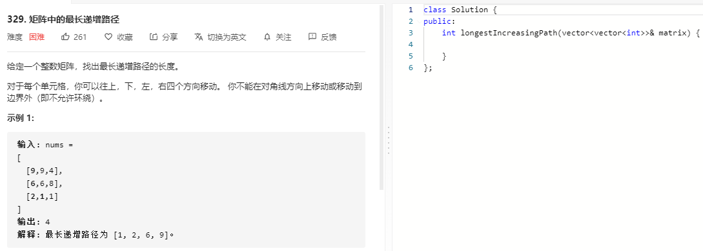

### 题目要求



### 解题思路

`dfs`+`memory`大法好。遍历(i, j)为起始，遇到已遍历过的可以直接返回，每次判断边界条件迭代最大值。

### 本题代码

```c++
class Solution {
public:
    int direction[4][2] = {{0, 1}, {0, -1}, {1, 0}, {-1, 0}};
    int longestIncreasingPath(vector<vector<int>>& matrix) {
        if(matrix.size() == 0 || matrix[0].size() == 0)
            return 0;
        vector<vector<int>>memo(matrix.size(), vector<int>(matrix[0].size(), 0));
        
        int res = 0;
        for(int i = 0;i < matrix.size();i++){
            for(int j = 0;j < matrix[0].size();j++){
                int num = dfs(matrix, i, j, memo);
                res = max(res, num);
            }
        }
        return res;
    }
    int dfs(vector<vector<int>>& matrix, int i, int j, vector<vector<int>>& memo){
        if(memo[i][j] != 0)
            return memo[i][j];
        memo[i][j]++; // 从自己开始，最小长度是1
        for(int num = 0;num < 4;num++){
            int x = j + direction[num][1];
            int y = i + direction[num][0];
            if(x >= 0 && x < matrix[0].size() && y >= 0 && y < matrix.size() && matrix[y][x] > matrix[i][j])
            memo[i][j] = max(memo[i][j], dfs(matrix, y, x, memo)+1);//满足条件+1
        }
        return memo[i][j];
    }
};
```

### [手撸测试](https://leetcode-cn.com/problems/longest-increasing-path-in-a-matrix/)  

